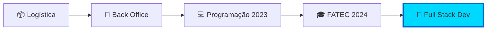

<div align="center">

#  Rafael Lopes Slivka


<br>

[](https://www.linkedin.com/in/rafael-lopes-slivka-07753326a/)
[](https://github.com/rafaslivka)
[](mailto:seu-email)

</div>

<br>


##  Sobre Mim

```javascript
const rafael = {
    education: "Banco de Dados @ FATEC (2024)",
    location: "São José dos Campos, SP 🇧🇷",
    background: ["Logística", "Back Office", "Programação"],
    currentFocus: ["Vue.js", "Frontend", "PostgreSQL"],
    learningMode: "Always ON 🚀",
    quote: "Transformando experiência operacional em soluções tecnológicas eficientes"
};
```

<details>
<summary>📖 <b>Minha Jornada</b></summary>
<br>



- 📦 **Experiência prévia:** Logística e Back Office
- 💻 **Virada de chave:** Programação desde 2023
- 🎯 **Objetivo atual:** Dominar Frontend Development
- 🔥 **Paixão:** Criar interfaces incríveis e intuitivas

</details>

<br>


##  Tech Stack

<div align="center">

### 💻 Frontend


### ⚙️ Backend


### 🗄️ Database & Tools


</div>

<br>


##  Projetos em Destaque

<div align="center">

### 🕐 Altime - Sistema de Controle de Ponto

<table>
<tr>
<td width="50%">

#### 📊 Sobre o Projeto
Sistema completo de **controle de ponto eletrônico** com dashboard interativo, desenvolvido para otimizar a gestão de empresas e colaboradores através de uma interface moderna e responsiva.

#### 🎯 Objetivo
Centralizar informações e proporcionar relatórios analíticos para facilitar a tomada de decisões empresariais.

</td>
<td width="50%">

#### 📈 Métricas


#### 🎓 Instituição
**FATEC Profº Jessen Vidal**  
São José dos Campos, SP

</td>
</tr>
</table>

<br>

#### 🔧 Stack do Projeto


</div>

<br>

<details>
<summary>✨ <b>Minhas Contribuições Detalhadas</b> (clique para expandir)</summary>
<br>

<div align="center">

| 🎯 Área | 🚀 Contribuições | 💡 Impacto |
|---------|------------------|------------|
| **🎨 Frontend** | • Páginas de cadastro (empresas/colaboradores)<br>• Dashboards interativos com gráficos<br>• Sistema de filtros e pesquisa avançada | Alta usabilidade e experiência do usuário |
| **🔧 Componentes** | • Biblioteca de componentes reutilizáveis<br>• Sistema de design responsivo<br>• Otimização de UX multiplataforma | Código limpo e manutenível |
| **🔌 Integração** | • Conexão com API RESTful<br>• Sincronização de dados em tempo real<br>• Tratamento de erros e loading states | Sistema robusto e confiável |
| **📊 Gestão** | • Participação em sprints e dailies<br>• Planejamento de tasks no Jira<br>• Code reviews e pair programming | Entrega contínua de valor |

</div>

<br>

### 🎯 Destaques Técnicos

```vue
<template>
  <!-- Dashboard interativo com gráficos em tempo real -->
  <DashboardComponent 
    :data="employeeData" 
    @filter="handleFilter"
    responsive
    animated
  />
</template>
```

**✅ Features Implementadas:**
- 📊 Visualização de dados em tempo real
- 🔍 Filtros avançados e pesquisa inteligente
- 📱 Design 100% responsivo
- ⚡ Performance otimizada
- 🎨 Interface moderna e intuitiva

</details>

<br>


##  Competências

<div align="center">

### 🔨 Hard Skills

</div>

<table>
<tr>
<td width="50%" valign="top">

### 🎨 Frontend Development
<br>

**🖼️ Vue.js/Nuxt.js**
```javascript
✓ Component Architecture
✓ Composition API
✓ State Management (Vuex/Pinia)
✓ Router & Navigation
✓ API Integration
✓ Performance Optimization
```

**💅 Styling & Design**
```css
✓ CSS3 & SASS/SCSS
✓ Responsive Design
✓ Design Systems
✓ Flexbox & Grid
✓ Animations & Transitions
✓ UI/UX Best Practices
```

</td>
<td width="50%" valign="top">

### ⚙️ Backend Development
<br>

**☕ Java & OOP**
```java
✓ SOLID Principles
✓ Clean Architecture
✓ Design Patterns
✓ Collections & Streams
✓ Lambda Expressions
✓ Exception Handling
```

**🍃 Spring Ecosystem**
```java
✓ Spring Boot
✓ RESTful APIs
✓ Dependency Injection
✓ JPA/Hibernate
✓ Spring Security
✓ API Documentation
```

</td>
</tr>
</table>

<div align="center">

### 🗄️ Database & DevOps

<br>

<table>
<tr>
<td align="center" width="33%">

**🐘 PostgreSQL**
<br><br>
✓ Modelagem Relacional<br>
✓ Otimização de Queries<br>
✓ Índices & Performance<br>
✓ Triggers & Functions<br>
✓ Administração de BD

</td>
<td align="center" width="33%">

**🐬 MySQL**
<br><br>
✓ Design de Schemas<br>
✓ Query Optimization<br>
✓ Backup & Recovery<br>
✓ Migrations<br>
✓ Performance Tuning

</td>
<td align="center" width="33%">

**🛠️ Tools & Workflows**
<br><br>
✓ Git & GitHub<br>
✓ Jira & Scrum<br>
✓ Swagger/OpenAPI<br>
✓ Postman<br>
✓ VS Code & IntelliJ

</td>
</tr>
</table>

</div>

<br>

<div align="center">

### 🌟 Soft Skills

</div>

<table>
<tr>
<td width="33%" align="center" valign="top">


### 🤝 Trabalho em Equipe

<br>

✅ Comunicação assertiva  
✅ Colaboração ativa  
✅ Suporte aos colegas  
✅ Integração com o time  
✅ Feedback construtivo

</td>
<td width="33%" align="center" valign="top">


### 💬 Comunicação

<br>

✅ Reuniões produtivas  
✅ Alinhamento de tasks  
✅ Documentação clara  
✅ Apresentações técnicas  
✅ Code reviews efetivos

</td>
<td width="33%" align="center" valign="top">


### 🧩 Problem Solving

<br>

✅ Análise de requisitos  
✅ Soluções criativas  
✅ Debugging eficiente  
✅ Otimização de código  
✅ Pensamento crítico

</td>
</tr>
</table>

<br>


##  GitHub Analytics

<div align="center">


<br>

### 🏆 GitHub Trophies


### 📊 Contribution Graph


</div>

<br>


##  Formação Acadêmica

<div align="center">

```
🎓 Tecnólogo em Banco de Dados
📍 FATEC Profº Jessen Vidal
📅 Turma 2024
🌆 São José dos Campos, SP
```

**Áreas de Foco:**
`Modelagem de Dados` • `SQL Avançado` • `NoSQL` • `Big Data` • `Data Analytics`

</div>

<br>


##  Vamos Conversar?

<div align="center">

### 💼 Aberto para oportunidades e colaborações!

<br>

[](https://www.linkedin.com/in/rafael-lopes-slivka-07753326a/)
[](mailto:seu-email)
[](seu-portfolio)
[](https://wa.me/seu-numero)

</div>

<br>


<div align="center">

### 🌟 Obrigado pela visita!


**Se você gostou do meu perfil, não esqueça de deixar uma ⭐ nos repositórios!**

<br>


<br>

<sub>Desenvolvido com ☕ Java, 💙 Vue.js e muita ⚡ dedicação</sub>


</div>
