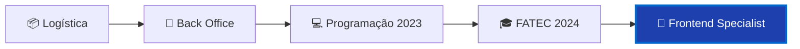

<div align="center">

#  Rafael Lopes Slivka


<br>

[](https://www.linkedin.com/in/rafael-lopes-slivka-07753326a/)
[](https://github.com/rafaslivka)
[](mailto:seu-email)

</div>

<br>


##  Introdução

🚀 Desenvolvedor em constante evolução, apaixonado por tecnologia e por resolver problemas reais com código

📍 Baseado em São José dos Campos, SP - Brasil

💼 Atualmente estagiário no Sebrae, onde combino habilidades técnicas com operações de negócios

🎓 Cursando Banco de Dados na FATEC, após completar um semestre em Logística

🚚 Trazendo 9 anos de experiência em logística para o mundo tech - entendo de operações, processos e eficiência

🌐 Inglês avançado, pronto para oportunidades globais

🎸 Entusiasta de rock que programa de dia e toca à noite - guitarra e bateria são meus refúgios criativos

💪 Sempre aprendendo, sempre evoluindo, sempre programando!

<details>
<summary>📖 <b>Minha Jornada</b></summary>
<br>



- 📦 **Experiência prévia:** Logística e operações de Back Office
- 💻 **Início na programação:** 2023
- 🎯 **Foco atual:** Desenvolvimento Frontend com Vue.js e Nuxt.js
- 🔥 **Paixão:** Criar experiências de usuário memoráveis e funcionais

</details>

<br>


##  Meus Principais Conhecimentos

<div align="center">

### 💻 Frontend


### ⚙️ Backend


### 🗄️ Database & Tools


</div>

<br>


##  Meus Projetos

### Em 2025-1

Durante o primeiro semestre de 2025, desenvolvi junto da minha equipe um projeto desafiador focado na criação de um **sistema de controle de ponto** que registra as movimentações dos funcionários, com dashboards de gráficos e geração de relatórios. O sistema registra a entrada e saída dos funcionários, calcula a quantidade de horas trabalhadas, e gera gráficos e relatórios com essas informações.

<div align="center">

### 🕐 Altime - Sistema de Controle de Ponto


</div>

**Empresa Parceira:** Projeto acadêmico desenvolvido no âmbito da FATEC, com parceria com a empresa Altave.

**Problema:** A necessidade de uma ferramenta que verificasse atrasos em funcionários de uma empresa terceira contratada, a fim de evitar atrasos e, por consequência, prejuízos para o cliente. Era necessário um sistema que centralizasse as informações de ponto, facilitasse a análise de dados e gerasse relatórios para tomada de decisão.

**Solução Entregue pela Equipe:** Desenvolvemos um sistema web que permite o cadastro de empresas, funcionários e suas informações específicas, possibilitando uma gestão centralizada e eficiente. O sistema conta com um dashboard interativo que oferece uma visão detalhada de todas as atividades, facilitando a análise e o acompanhamento dos dados relacionados à gestão de pessoas e processos. Esta interface possibilita diversos filtros para os usuários, além de oferecer gráficos interativos e extração de relatórios em PDF e Excel para melhor análise e tomada de decisões.

**Repositório do projeto:** [DenariusData - Sistema Altime](https://github.com/DenariusData/API-3SEM)

<br>

#### 🔧 Tecnologias Utilizadas


**Nuxt.js:** Framework Vue utilizado para construir o frontend da aplicação, permitindo renderização server-side (SSR) e geração de sites estáticos (SSG) para melhor performance e SEO.

**Vue.js:** Framework JavaScript progressivo para construção de interfaces de usuário, utilizado para criar componentes reutilizáveis e reativas.

**MySQL:** Banco de dados relacional utilizado para armazenar de forma estruturada os dados de empresas, funcionários e registros de ponto.

**Java 21:** Linguagem principal do backend, com ênfase em orientação a objetos e utilização de recursos modernos da linguagem.

**Spring Boot:** Framework para desenvolvimento da API RESTful, responsável por expor endpoints para comunicação com o frontend. Utilizou-se Spring Data JPA para mapeamento objeto-relacional (ORM) com o MySQL.

**Chart.js:** Biblioteca JavaScript para criação de gráficos interativos e responsivos no dashboard.

**Figma:** Ferramenta de design utilizada para criação de wireframes e protótipos da interface do usuário.

#### 🔗 Links do Repositório
[](https://github.com/DenariusData/DenariusData-Front)
[](https://github.com/DenariusData/DenariusData-Back)
[](https://github.com/DenariusData/DenariusData-Front/tree/Sprint-1/Front/pages)

<br>

### Contribuições Pessoais

Atuei como **desenvolvedor frontend** com participação estratégica no desenvolvimento da interface do usuário e na integração com o backend. Minhas contribuições iniciaram na concepção da interface através de wireframes, evoluindo para o desenvolvimento completo das funcionalidades front-end. Esta visão focada na experiência do usuário me permitiu entregar soluções intuitivas e alinhadas com os objetivos do negócio, sempre focando na qualidade do produto final e na eficiência da interface.

**Principais Atividades:**

- Desenvolvimento de wireframes para planejamento das sprints
- Desenvolvimento front-end completo utilizando Vue.js e Nuxt.js
- Criação de páginas de cadastro de empresas e funcionários
- Implementação de dashboard interativo com gráficos utilizando Chart.js
- Desenvolvimento do sistema de registro de ponto com validação de formulários
- Criação do sistema de relatórios com exportação em PDF e Excel
- Implementação de filtros dinâmicos por empresa e funcionário
- Integração com API REST do backend
- Estilização responsiva dos componentes com CSS e SASS

<br>

<details>
<summary><b>🎯 Destaques Técnicos - Códigos Desenvolvidos</b> (clique para expandir)</summary>
<br>

> 💡 **Ver código completo:** [Acessar pasta de páginas no repositório](https://github.com/DenariusData/DenariusData-Front/tree/Sprint-1/Front/pages)

#### 📝 Página de Registro de Ponto
```vue
<script setup lang="ts">
import { object, string, date } from 'yup'
import type { FormSubmitEvent } from '#ui/types'

const workSchema = object({
    date: date().required('Escolha uma data válida'),
    startTime: string().required('Horário de entrada obrigatório'),
    endTime: string().required('Horário de saída obrigatório'),
    company: string().required('Selecione a empresa'),
    employee: string().required('Selecione o funcionário')
})

const workState = reactive({
    date: undefined,
    startTime: undefined,
    endTime: undefined,
    company: undefined,
    employee: undefined
})

async function onSubmit(event: FormSubmitEvent<WorkSchema>) {
    console.log('Dados do trabalho:', event.data)
}
</script>

<template>
    <UCard class="w-full md:w-1/3">
        <UForm :schema="workSchema" :state="workState" @submit="onSubmit">
            <UFormGroup label="Empresa" name="company">
                <USelect v-model="workState.company" :options="companies" />
            </UFormGroup>
            <UFormGroup label="Funcionário" name="employee">
                <USelect v-model="workState.employee" :options="employees" />
            </UFormGroup>
            <UFormGroup label="Dia Trabalhado" name="date">
                <UInput v-model="workState.date" type="date" />
            </UFormGroup>
            <UButton type="submit" label="Salvar registro" color="primary" block />
        </UForm>
    </UCard>
</template>
```
📂 [Ver código completo da página de ponto](https://github.com/DenariusData/DenariusData-Front/blob/Sprint-1/Front/pages/ponto.vue)

#### 📊 Dashboard com Gráficos Interativos
```vue
<script setup>
import { ref, watch } from "vue";
import { Chart, registerables } from "chart.js";

Chart.register(...registerables);

const pieChart = ref(null);
const lineChart = ref(null);
const barChart = ref(null);

const empresaSelecionada = ref("");
const funcionarioSelecionado = ref("");

watch(empresaSelecionada, () => {
  funcionarioSelecionado.value = "";
  funcionariosFiltrados.value = funcionariosPorEmpresa[empresaSelecionada.value] || [];
});

onMounted(() => {
  // Gráfico de Pizza: Empresas cadastradas
  new Chart(pieChart.value, {
    type: "pie",
    data: {
      labels: ["Empresa A", "Empresa B", "Empresa C", "Empresa D"],
      datasets: [{
        data: [10, 20, 15, 30],
        backgroundColor: ["rgba(255, 99, 132, 0.5)", "rgba(54, 162, 235, 0.5)"]
      }]
    }
  });
  
  // Gráfico de Linha: Profissionais por dia
  new Chart(lineChart.value, {
    type: "line",
    data: {
      labels: ["Seg", "Ter", "Qua", "Qui", "Sex"],
      datasets: [{
        label: "Profissionais por Dia",
        data: [10, 12, 8, 15, 9],
        borderColor: "rgba(54, 162, 235, 1)"
      }]
    }
  });
});
</script>
```
📂 [Ver código completo do dashboard](https://github.com/DenariusData/DenariusData-Front/blob/Sprint-1/Front/pages/index.vue)

#### 📄 Sistema de Relatórios
```vue
<script setup>
import * as XLSX from 'xlsx';
import { jsPDF } from 'jspdf';
import axios from 'axios';

const funcionarios = ref<any[]>([]);
const funcionariosSelecionados = ref<any[]>([]);

const fetchFuncionarios = async () => {
  try {
    const response = await axios.get('http://localhost:8080/api/funcionarios');
    funcionarios.value = response.data;
  } catch (error) {
    console.error('Erro ao carregar os funcionários', error);
  }
};

const exportToExcel = () => {
  const dadosExportados = funcionariosSelecionados.value.map(({ imagem, ...rest }) => rest);
  const ws = XLSX.utils.json_to_sheet(dadosExportados);
  const wb = XLSX.utils.book_new();
  XLSX.utils.book_append_sheet(wb, ws, 'Funcionarios');
  XLSX.writeFile(wb, 'relatorio_funcionarios.xlsx');
};

const exportToPDF = () => {
  const doc = new jsPDF();
  doc.text('Relatório de Funcionários', 14, 20);
  // Geração personalizada de PDF com dados e imagens
  doc.save('relatorio_funcionarios.pdf');
};
</script>
```
📂 [Ver código completo de relatórios](https://github.com/DenariusData/DenariusData-Front/blob/Sprint-1/Front/pages/relatorios.vue)

<br>

**✅ Funcionalidades Implementadas:**
- 📊 Dashboard com 3 tipos de gráficos (Pizza, Linha, Barras)
- 🔍 Sistema de filtros dinâmicos por empresa e funcionário
- 📄 Exportação de relatórios em PDF e Excel
- ✍️ Validação completa de formulários com Yup Schema
- 📱 Interface 100% responsiva e mobile-first
- ⚡ Performance otimizada com Vue 3 Composition API
- 🎨 Design system consistente com Nuxt UI
- 🖼️ Upload e exibição de imagens de funcionários
- 📈 Cálculo automático de horas trabalhadas

<br>

**🔗 Acesse o código:**
- 📁 [Repositório Frontend Completo](https://github.com/DenariusData/DenariusData-Front)
- 💻 [Códigos da Sprint 1 - Páginas](https://github.com/DenariusData/DenariusData-Front/tree/Sprint-1/Front/pages)
- 🎨 [Componentes Reutilizáveis](https://github.com/DenariusData/DenariusData-Front/tree/Sprint-1/Front/components)

</details>

<br>

### Hard Skills

**Vue.js/Nuxt.js:** Domínio avançado em arquitetura de componentes, Composition API, gerenciamento de estado com Pinia, e compreensão profunda de como é feita a comunicação entre sistemas via API REST. Experiência em SSR (Server-Side Rendering) e SSG (Static Site Generation) com Nuxt.js para otimização de performance.

**CSS/SASS:** Domínio avançado em estilização de componentes visuais, com habilidade em implementar design systems consistentes, garantindo identidade visual coesa. Experiência em criar layouts responsivos utilizando Flexbox e Grid, além de animações e transições suaves. Conhecimento em pré-processadores como SASS para modularização e reutilização de código.

**JavaScript/TypeScript:** Domínio intermediário em JavaScript moderno (ES6+) e TypeScript, aplicando tipagem estática para maior segurança no código. Experiência com programação assíncrona (Promises, async/await), manipulação de arrays e objetos, e validação de dados.

**Integração de APIs:** Experiência sólida em consumo de APIs RESTful utilizando Axios, tratamento de erros, gerenciamento de estados de loading, e formatação de dados. Conhecimento em autenticação e autorização via tokens JWT.

**Visualização de Dados:** Domínio intermediário em Chart.js para criação de gráficos interativos e responsivos, incluindo gráficos de pizza, linha e barras com filtros dinâmicos e atualizações em tempo real.

**Java e Spring Boot:** Conhecimento intermediário em desenvolvimento backend com Java, utilizando Spring Boot para criação de APIs RESTful, Spring Data JPA para persistência de dados, e integração com bancos de dados relacionais.

**Banco de Dados:** Experiência em modelagem de bancos de dados relacionais (MySQL, PostgreSQL), criação de queries SQL otimizadas, e compreensão de normalização e relacionamentos entre tabelas.

<br>

### Soft Skills

**Trabalho em equipe:** Atuei com comunicação constante com o resto do time, principalmente com os desenvolvedores do backend para garantir a integração perfeita entre frontend e API. Participei ativamente de pair programming e code reviews, oferecendo suporte aos membros com dificuldades e promovendo um ambiente colaborativo. Em casos de discordância no time, expressei minha opinião de forma construtiva e evitei o acúmulo de problemas.

**Comunicação:** Participei ativamente de reuniões semanais (dailies, planning, review e retrospectiva) com o time, garantindo alinhamento entre as entregas e as expectativas do cliente. Mantive uma comunicação clara e objetiva com o Product Owner e o Scrum Master, detalhando minhas abordagens para as tarefas e antecipando possíveis desafios técnicos. Documentei decisões importantes e compartilhei conhecimento com a equipe.

**Resolução de problemas:** Contribuí para o planejamento e estruturação inicial das interfaces através de wireframes, propondo soluções práticas para desafios de UX/UI. Atuei na arquitetura do frontend, otimizando fluxos críticos de navegação e implementando melhorias que tornaram o sistema mais eficiente e intuitivo. Minha abordagem proativa ajudou a resolver problemas de integração com o backend e a manter o progresso do projeto dentro dos prazos estabelecidos.

**Proatividade:** Busquei constantemente aprender novas tecnologias e melhores práticas para aplicar no projeto. Identifiquei oportunidades de melhoria na interface e propus soluções antes que se tornassem problemas. Auxiliei na documentação do código e na criação de guias para facilitar a manutenção futura do sistema.

<br>


##  GitHub Analytics

<div align="center">


<br>

### 🏆 GitHub Trophies


### 📊 Contribution Graph


</div>

<br>


##  Formação Acadêmica

<div align="center">

```
🎓 Tecnólogo em Banco de Dados
📍 FATEC Profº Jessen Vidal
📅 Turma 2024
🌆 São José dos Campos, SP
```

**Áreas de Foco:**
`Modelagem de Dados` • `SQL Avançado` • `Desenvolvimento Web` • `API REST` • `UX/UI Design`

</div>

<br>


##  Vamos Conversar?

<div align="center">

### 💼 Aberto para oportunidades e colaborações!

<br>

[](https://www.linkedin.com/in/rafael-lopes-slivka-07753326a/)
[](mailto:seu-email)
[](https://github.com/rafaslivka)

</div>

<br>


<div align="center">

### 🌟 Obrigado pela visita!


**Se você gostou do meu perfil, não esqueça de deixar uma ⭐ nos repositórios!**

<br>


<br>

<sub>Desenvolvido com 💙 Vue.js, ☕ Java e muita ⚡ dedicação</sub>


</div>
