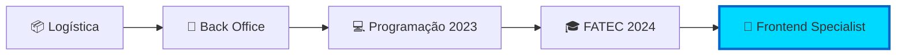

<div align="center">

#  Rafael Lopes Slivka


<br>

[](https://www.linkedin.com/in/rafael-lopes-slivka-07753326a/)
[](https://github.com/rafaslivka)
[](mailto:seu-email)

</div>

<br>


##  Sobre Mim

🚀 Desenvolvedor em constante evolução, apaixonado por tecnologia e por resolver problemas reais com código

📍 São José dos Campos, SP - Brasil

💼 Atualmente estagiário no Sebrae, onde combino habilidades técnicas com operações de negócios e empreededorismo

🎓 Cursando Banco de Dados na FATEC, após completar um semestre em Logística

🚚 Trazendo 9 anos de experiência em logística para o mundo tech - entendo de operações, processos e eficiência

🌐 Inglês avançado, pronto para oportunidades globais

🎸 Entusiasta de rock que programa de dia e toca à noite - guitarra e bateria são meus refúgios criativos

💪 Sempre aprendendo, sempre evoluindo, sempre programando!

<br>

<details>
<summary>📖 <b>Minha Jornada</b></summary>
<br>



- 📦 **Experiência prévia:** Logística e operações de Back Office
- 💻 **Início na programação:** 2023
- 🎯 **Foco atual:** Desenvolvimento Frontend com Vue.js e Nuxt.js
- 🔥 **Paixão:** Criar experiências de usuário memoráveis e funcionais

</details>

<br>


##  Tech Stack

<div align="center">

### 💻 Frontend


### ⚙️ Backend


### 🗄️ Database & Tools


</div>

<br>


##  Projeto em Destaque

<div align="center">

### 🕐 Altime - Sistema de Controle de Ponto

<table>
<tr>
<td width="50%">

#### 📊 Sobre o Projeto
Sistema completo de **controle de ponto eletrônico** desenvolvido para otimizar a gestão empresarial através de uma interface moderna, responsiva e intuitiva.

#### 🎯 Características
Sistema centralizado de informações com dashboards analíticos e relatórios detalhados para facilitar a tomada de decisões.

</td>
<td width="50%">

#### 📈 Informações


#### 🎓 Instituição
**FATEC Profº Jessen Vidal**  
São José dos Campos, SP

</td>
</tr>
</table>

<br>

#### 🔧 Stack Tecnológica


#### 🔗 Links do Repositório
[](https://github.com/DenariusData/DenariusData-Front)
[](https://github.com/DenariusData/DenariusData-Front/tree/Sprint-1/Front/pages)

</div>

<br>

<details>
<summary>✨ <b>Minhas Contribuições no Frontend</b> (clique para expandir)</summary>
<br>

<div align="center">

| 🎯 Área | 🚀 Implementações | 💡 Tecnologias |
|---------|------------------|----------------|
| **🎨 Páginas** | • Registro de ponto com validação de formulários<br>• Dashboard com gráficos interativos<br>• Sistema de relatórios (PDF/Excel)<br>• Cadastro de empresas e colaboradores | Vue 3, Nuxt.js, TypeScript |
| **📊 Visualização** | • Gráficos de pizza para empresas<br>• Gráficos de linha para frequência<br>• Gráficos de barras com filtros dinâmicos<br>• Filtros por empresa e funcionário | Chart.js, Vue Reactivity |
| **🔄 Integração** | • Consumo de API REST<br>• Tratamento de estados de loading<br>• Validação com Yup Schema<br>• Upload e exibição de imagens | Axios, Vue Composition API |
| **📱 Responsividade** | • Design mobile-first<br>• Componentes reutilizáveis<br>• Interface adaptativa<br>• UX otimizada | Tailwind CSS, Nuxt UI |

</div>

<br>

### 🎯 Destaques Técnicos - Sprint 1

> 💡 **Ver código completo:** [Acessar pasta de páginas no repositório](https://github.com/DenariusData/DenariusData-Front/tree/Sprint-1/Front/pages)

#### 📝 Página de Registro de Ponto
```vue
<script setup lang="ts">
import { object, string, date } from 'yup'
import type { FormSubmitEvent } from '#ui/types'

const workSchema = object({
    date: date().required('Escolha uma data válida'),
    startTime: string().required('Horário de entrada obrigatório'),
    endTime: string().required('Horário de saída obrigatório'),
    company: string().required('Selecione a empresa'),
    employee: string().required('Selecione o funcionário')
})

const workState = reactive({
    date: undefined,
    startTime: undefined,
    endTime: undefined,
    company: undefined,
    employee: undefined
})
</script>
```
📂 [Ver código completo da página de ponto](https://github.com/DenariusData/DenariusData-Front/blob/Sprint-1/Front/pages/ponto.vue)

#### 📊 Dashboard com Gráficos Interativos
```vue
<script setup>
import { ref, watch } from "vue";
import { Chart, registerables } from "chart.js";

const empresaSelecionada = ref("");
const funcionarioSelecionado = ref("");

watch(empresaSelecionada, () => {
  funcionarioSelecionado.value = "";
  atualizarGrafico();
});

// Gráficos: Pizza, Linha e Barras com filtros
</script>
```
📂 [Ver código completo do dashboard](https://github.com/DenariusData/DenariusData-Front/blob/Sprint-1/Front/pages/index.vue)

#### 📄 Sistema de Relatórios
```vue
<script setup>
import * as XLSX from 'xlsx';
import { jsPDF } from 'jspdf';

const exportToExcel = () => {
  const ws = XLSX.utils.json_to_sheet(funcionariosSelecionados.value);
  const wb = XLSX.utils.book_new();
  XLSX.utils.book_append_sheet(wb, ws, 'Funcionarios');
  XLSX.writeFile(wb, 'relatorio_funcionarios.xlsx');
};

const exportToPDF = () => {
  const doc = new jsPDF();
  // Geração personalizada de PDF com dados e imagens
};
</script>
```
📂 [Ver código completo de relatórios](https://github.com/DenariusData/DenariusData-Front/blob/Sprint-1/Front/pages/relatorios.vue)

<br>

**✅ Funcionalidades Implementadas:**
- 📊 Dashboard com 3 tipos de gráficos (Pizza, Linha, Barras)
- 🔍 Sistema de filtros dinâmicos por empresa e funcionário
- 📄 Exportação de relatórios em PDF e Excel
- ✍️ Validação completa de formulários com Yup
- 📱 Interface 100% responsiva
- ⚡ Performance otimizada com Vue 3 Composition API
- 🎨 Design system consistente com Nuxt UI

<br>

**🔗 Acesse o código:**
- 📁 [Repositório Frontend Completo](https://github.com/DenariusData/DenariusData-Front)
- 💻 [Códigos da Sprint 1 - Páginas](https://github.com/DenariusData/DenariusData-Front/tree/Sprint-1/Front/pages)
- 🎨 [Componentes Reutilizáveis](https://github.com/DenariusData/DenariusData-Front/tree/Sprint-1/Front/components)

</details>

<br>

<details>
<summary>🏆 <b>Resultados do Projeto</b></summary>
<br>

### 📈 Impacto e Aprendizados

- ✅ **Sistema completo** entregue em 3 sprints
- ✅ **Interface moderna** aprovada pelo cliente
- ✅ **Funcionalidades** 100% operacionais
- ✅ **Código limpo** e manutenível
- ✅ **Documentação** completa do sistema

### 💪 Competências Desenvolvidas

- Arquitetura de componentes Vue.js/Nuxt.js
- Integração Frontend-Backend via API REST
- Manipulação avançada de gráficos com Chart.js
- Geração de relatórios (PDF/Excel)
- Trabalho em equipe com metodologia ágil (SCRUM)
- Versionamento com Git e GitHub

</details>

<br>


##  Competências

<div align="center">

### 🔨 Hard Skills

</div>

<table>
<tr>
<td width="50%" valign="top">

### 🎨 Frontend Development
<br>

**🖼️ Vue.js/Nuxt.js**
```javascript
✓ Composition API
✓ Component Architecture
✓ State Management (Pinia)
✓ SSR & SSG
✓ Nuxt UI & Tailwind
✓ Form Validation (Yup)
```

**📊 Data Visualization**
```javascript
✓ Chart.js Integration
✓ Dynamic Graphs
✓ Real-time Updates
✓ Custom Filters
✓ Export Functionality
```

</td>
<td width="50%" valign="top">

### ⚙️ Backend & Integration
<br>

**☕ Java & Spring**
```java
✓ REST API Development
✓ Spring Boot
✓ JPA/Hibernate
✓ API Documentation
✓ CRUD Operations
```

**🔌 API Integration**
```javascript
✓ Axios HTTP Client
✓ Error Handling
✓ Loading States
✓ File Upload
✓ Data Formatting
```

</td>
</tr>
</table>

<div align="center">

### 🗄️ Database & DevOps

<br>

<table>
<tr>
<td align="center" width="33%">

**🐘 PostgreSQL**
<br><br>
✓ Modelagem Relacional<br>
✓ Query Optimization<br>
✓ Índices & Performance<br>
✓ Triggers & Functions

</td>
<td align="center" width="33%">

**🐬 MySQL**
<br><br>
✓ Database Design<br>
✓ Complex Queries<br>
✓ Backup & Recovery<br>
✓ Performance Tuning

</td>
<td align="center" width="33%">

**🛠️ Tools & Workflow**
<br><br>
✓ Git & GitHub<br>
✓ Jira & Scrum<br>
✓ Figma & Design<br>
✓ Swagger/OpenAPI

</td>
</tr>
</table>

</div>

<br>

<div align="center">

### 🌟 Soft Skills

</div>

<table>
<tr>
<td width="33%" align="center" valign="top">


### 🤝 Trabalho em Equipe

<br>

✅ Colaboração ágil  
✅ Comunicação efetiva  
✅ Code reviews  
✅ Pair programming  
✅ Feedback construtivo

</td>
<td width="33%" align="center" valign="top">


### 💬 Adaptabilidade

<br>

✅ Aprendizado rápido  
✅ Metodologia ágil  
✅ Resolução de problemas  
✅ Gestão de tempo  
✅ Foco em resultados

</td>
<td width="33%" align="center" valign="top">


### 🧩 Proatividade

<br>

✅ Iniciativa própria  
✅ Busca por soluções  
✅ Melhoria contínua  
✅ Autonomia  
✅ Entrega de valor

</td>
</tr>
</table>

<br>


##  GitHub Analytics

<div align="center">


<br>

### 🏆 GitHub Trophies


### 📊 Contribution Graph


</div>

<br>


##  Formação Acadêmica

<div align="center">

```
🎓 Tecnólogo em Banco de Dados
📍 FATEC Profº Jessen Vidal
📅 Turma 2024
🌆 São José dos Campos, SP
```

**Áreas de Foco:**
`Modelagem de Dados` • `SQL Avançado` • `Desenvolvimento Web` • `API REST` • `UX/UI Design`

</div>

<br>


##  Vamos Conversar?

<div align="center">

### 💼 Aberto para oportunidades e colaborações!

<br>

[](https://www.linkedin.com/in/rafael-lopes-slivka-07753326a/)
[](mailto:seu-email)
[](https://github.com/rafaslivka)

</div>

<br>


<div align="center">

### 🌟 Obrigado pela visita!


**Se você gostou do meu perfil, não esqueça de deixar uma ⭐ nos repositórios!**

<br>


<br>

<sub>Desenvolvido com 💙 Vue.js, ☕ Java e muita ⚡ dedicação</sub>


</div>
